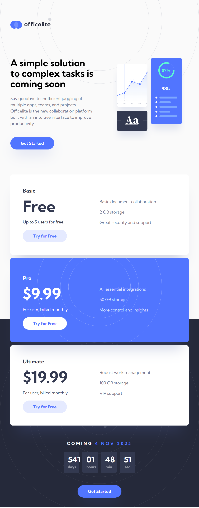
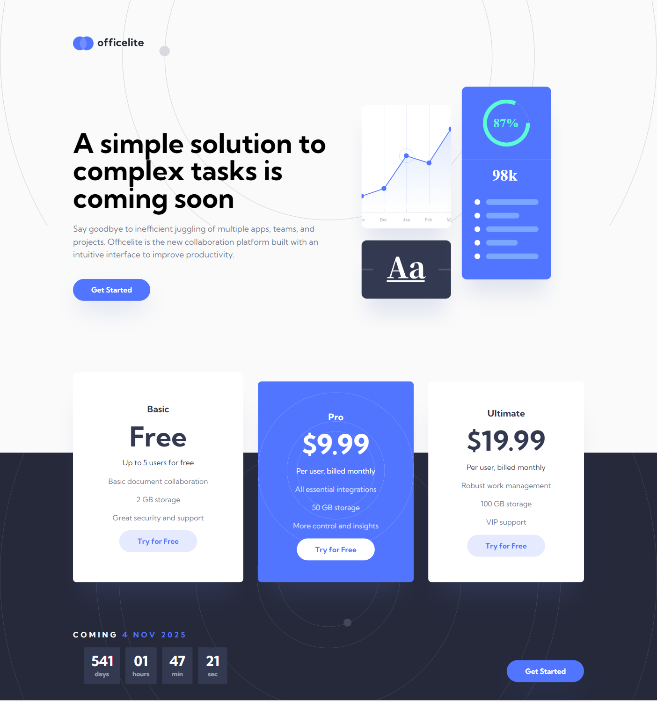

## Table of contents

- [Overview](#overview)
  - [The challenge](#the-challenge)
  - [Screenshot](#screenshot)
  - [Links](#links)
- [My process](#my-process)
  - [Built with](#built-with)
  - [What I learned](#what-i-learned)
  - [Continued development](#continued-development)
  - [Useful resources](#useful-resources)
- [Author](#author)

## Overview

### The challenge

Users should be able to:

- View the optimal layout for the site depending on their device's screen size
- See hover states for all interactive elements on the page
- See error states when the contact form is submitted if:
  - The `Email Address` is not formatted correctly
- See a live countdown timer that ticks down every second
- See a custom-styled `select` form control in the sign-up form

### Screenshot

- Screnshots for the mobile, tablet and desktop versions of 375px, 768px and 1440px.

### Links

- Live site [live site](https://officelite-coming-soon.onrender.com)

## My process

### Built with

- Semantic HTML5 markup
- CSS custom properties
- Flexbox
- CSS Grid
- Mobile-first workflow
- [TailwindCss](https://tailwindcss.com/) - Tailwind CSS

### What I learned

- Tailwind CSS framework, how to use it implementing customizations in the tailwind-config.js.
- Add media query themes and work with them.
- Extend customized classes
- How to create class components
- Create customized modern forms.
- Use time intervals in javascript
- Inject data in the HTML dynamically.
- Use type modules and export / import functions.
- Improved general vision, concept and psychology of web programming.
- In future projects will try to build one section make it fully responsive, and only then will proceed to another sections, as it was hard for me to work with media queries after finished whole page, and run through the code.
- Implementing @apply to avoid repetitions and make code more dynamic.

### Continued development

- Fix media queries.

### Useful resources

- [Tailwind documentation](https://tailwindcss.com/docs/installation) - Very useful documentation while working with Tailwind framework, to double check how to use CSS properties.

## Author

- Linkedin - [Nika Merabishvili](https://www.linkedin.com/in/nikusha-merabishvili/)
